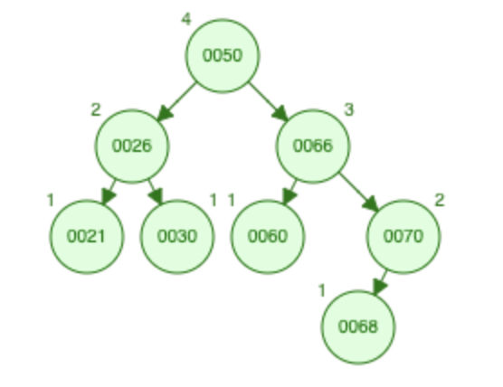
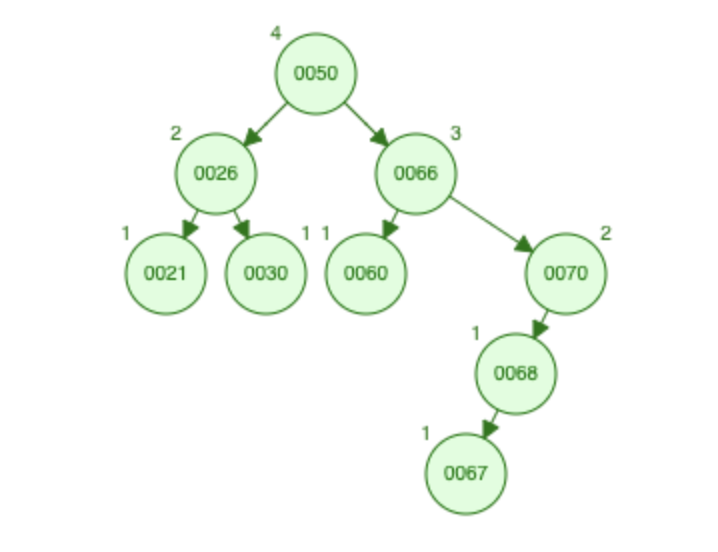
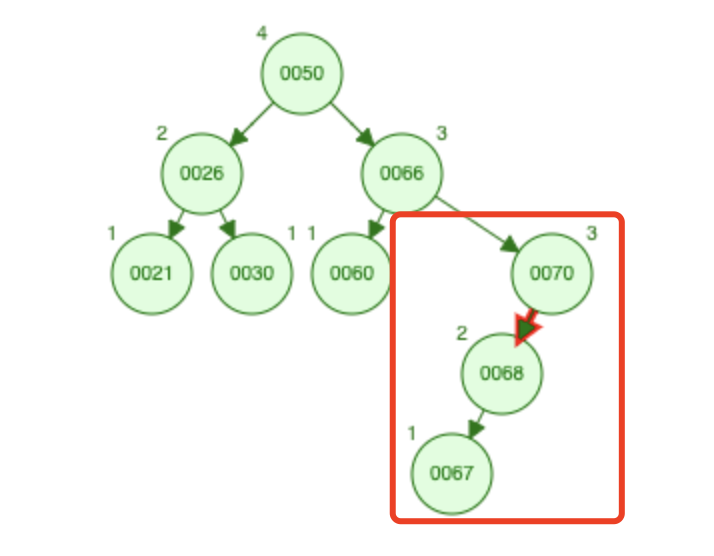

AVL 树是一种自平衡二叉搜索树。
在 AVL 树中，每个结点都有一个平衡因子，即任何一个结点的左子树高度与右子树高度之差的绝对值不超过 1。
如果有任何一个结点的平衡因子的绝对值大于 1，则这棵树就不是 AVL 树。

AVL 树的优点是查找、插入和删除操作的时间复杂度都是 O(log n)，相比于普通的二叉搜索树，能够更快地进行这些操作。
缺点是在进行插入和删除操作时需要进行旋转操作来恢复平衡，这会增加额外的开销。

----

来试着写一下。先定义 AVL 树结点的结构：

```C
typedef struct AVLTreeNode
{
  int key;                             // 结点键值
  int height;                          // 结点高度
  struct AVLTreeNode *lchild, *rchild; // 左右子树指针
} AVLTreeNode, *AVLTree;               // AVLTree是AVL树的指针类型，指向根结点
```

定义方法来创建结点：

```C
AVLTreeNode *CreateNode(int key)
{
  AVLTreeNode *node = (AVLTreeNode *)malloc(sizeof(AVLTreeNode));
  node->key = key;
  node->height = 1;
  node->lchild = node->rchild = NULL;
  return node;
}
```

然后需要写一些辅助方法来计算结点的平衡因子，以及旋转后更新结点的高度：

```C
// 获取结点高度
int GetHeight(AVLTreeNode *node)
{
  return node != NULL ? node->height : 0;
}

// 获取结点平衡因子（左右子树高度差）
int GetBalance(AVLTreeNode *node)
{
  return GetHeight(node->lchild) - GetHeight(node->rchild);
}

// 返回a和b中较大的值
int Max(int a, int b)
{
  return a > b ? a : b;
}

// 更新结点高度
void UpdateHeight(AVLTreeNode *node)
{
  node->height = Max(GetHeight(node->lchild), GetHeight(node->rchild)) + 1;
}
```

OK，准备工作都完成了。接下来写 AVL 树的插入以及删除操作。
因为 AVL 树本身就是一棵二叉排序树，要进行插入以及删除结点的计算非常简单，难点其实就在于插入和删除操作都可能会破坏平衡，需要旋转操作来恢复平衡。

旋转操作其实就是类似于让子结点来当父结点，原来的父结点变成新父结点的子结点。
听起来有点绕，画个图理解一下，假设现在有一棵普通的二叉排序树：G > F > S


它经过旋转之后变成这样：


或者这样：


旋转之后依旧符合 G > F > S 的规则，不如说只能在这个基础上进行旋转。

插入节点可能会导致AVL树失去平衡的情况主要有四种：
- LL：在结点的左子树的左侧插入新节点。
- LR：在结点的左子树的右侧插入新节点。
- RL：在结点的右子树的左侧插入新节点。
- RR：在结点的右子树的右侧插入新节点。

对于每一种情况，AVL树都有相应的旋转操作来恢复平衡。
首先需要找到最小不平衡树，从插入的新结点开始自底向上，沿着父结点向上寻找到第一个平衡因子的绝对值大于 1 的结点，以这个结点为根结点的子树就是最小不平衡树。
举个例子，现在有一棵这样的 AVL 树：



现在要插入一个新结点 67，在右下的位置：



肉眼可见的这次插入导致这棵 AVL 树失去了平衡，那么从插入节点开始沿着父结点向上寻找到第一个平衡因子的绝对值大于 1 的结点为根结点的子树，即它的最小不平衡树为：



在找到最小不平衡树后，下列都是在这棵子树内做的操作，四种插入对应的旋转操作为：
- LL：既然是插入左子树的左侧导致失衡，那么一定是左子树的高度高于右子树，调整的方法是将整个子树右旋。
- LR：插入左子树的右侧导致失衡，原因是左子树的右子树 高度高于 左子树的左子树 导致了 左子树 高于 右子树，调整的方法是先将左子树左旋，再将整个子树右旋。
- RL：其实原理和 LR 差不多的，调整方法是先将右子树右旋，再将整个子树左旋。
- RR：其实原理和 LL 差不多的，调整方法是将整个子树左旋。

这里我就不列图例了，因为看图让我觉得更容易迷糊，掌握这个逻辑思路之后其实用抽象的方式更容易理解。

那插入的实现思路就是：
1. 遍历树寻找合适的空结点，创建结点并插入值。
2. 因为遍历是递归过程，每次获取当前结点的平衡因子，如果平衡因子的绝对值大于 1，则以这个结点为根节点的子树一定是最小不平衡树。
3. 确定插入的类型，平衡因子大于 1 就是左子树高于右子树 (L)，小于 -1 就是右子树高于左子树 (R)。
    然后再获取高度较高的那边子树的平衡因子，以同样的方式确认插入的方向。
4. 按照上面的对应旋转操作改指针指向就完事了。

插入的代码实现：
```C
AVLTreeNode *Insert(AVLTree *tree, int key)
{
  if (!(*tree)) // 如果树为空
  {
    *tree = CreateNode(key); // 创建新结点并作为树的根结点
    return *tree;
  }
  if (key < (*tree)->key) // 如果插入值小于当前结点键值
  {
    (*tree)->lchild = Insert(&((*tree)->lchild), key); // 将其插入左子树
  }
  else // 否则将其插入右子树
  {
    (*tree)->rchild = Insert(&((*tree)->rchild), key);
  }
  int balance = GetBalance(*tree); // 获取当前结点平衡因子
  if (abs(balance) > 1)            // 如果平衡因子超过1，则需要旋转平衡
  {
    AVLTreeNode *q;
    if (balance > 0) // 如果左子树高度大于右子树高度
    {
      int lb = GetBalance((*tree)->lchild); // 获取左子树的平衡因子
      // LL型（左子树的左子树上插入元素）
      if (lb > 0)
      {
        q = (*tree)->lchild;
        (*tree)->lchild = q->rchild;
        q->rchild = (*tree);
      }
      // LR型（左子树的右子树上插入元素）
      else
      {
        q = (*tree)->lchild->rchild;
        (*tree)->lchild->rchild = q->lchild;
        q->lchild = (*tree)->lchild;
        UpdateHeight(q->lchild);
        (*tree)->lchild = q->rchild;
        q->rchild = (*tree);
        UpdateHeight(*tree);
        *tree = q;
      }
    }
    else // 如果右子树高度大于等于左子树高度
    {
      int rb = GetBalance((*tree)->rchild); // 获取右子树的平衡因子
      // RL型（右子树的左子树上插入元素）
      if (rb > 0)
      {
        q = (*tree)->rchild->lchild;
        (*tree)->rchild->lchild = q->rchild;
        q->rchild = (*tree)->rchild;
        UpdateHeight(q->rchild);
        (*tree)->rchild = q->lchild;
        q->lchild = (*tree);
        UpdateHeight(*tree);
        *tree = q;
      }
      // RR型（右子树的右子树上插入元素）
      else
      {
        q = (*tree)->rchild;
        (*tree)->rchild = q->lchild;
        q->lchild = (*tree);
      }
    }
    UpdateHeight(*tree); // 更新当前结点高度
    return q;
  }
  UpdateHeight(*tree); // 更新当前结点高度
  return *tree;
}
```

而删除就更简单了，因为 AVL 树就是二叉排序树，它的删除操作和二叉排序树的删除操作是一样的，都是使用删除结点的直接前驱或者直接后继结点来替换删除结点。
当然，删除结点之后也需要进行平衡操作来保证 AVL 树的平衡。
删除结点可能会导致 AVL 树失去平衡的情况主要有两种：

- LL：删除了左子树的左侧结点导致失衡，调整方法是将整个子树右旋。
- RR：删除了右子树的右侧结点导致失衡，调整方法是将整个子树左旋。

实现思路和插入有点类似：
1. 从根节点自顶向下查找要删除的结点，用一个数组存储经过的所有结点。
2. 找到该结点后，根据结点的高度属性是否是叶子结点。
3. 如果是叶子结点，判断是否是根节点，如果是则将树设为空；如果不是则将其父结点指向删除节点的方向设为空。
4. 如果不是叶子结点，计算左右子树哪边高度比较高，接着向下查找直接前驱或直接后继结点来替换。
5. 当删除操作完成后，沿着经过的结点数组往回重新计算高度和平衡因子，如果失衡则最小不平衡树的根节点一定也这个数组里面。

下面是根据思路实现的删除方法的代码：
```C
void Delete(AVLTree *tree, int n)
{
  AVLTreeNode *p = *tree;
  if (!p)
    return;

  // 用数组存储路径上的所有结点
  AVLTreeNode *routes[MAX_HEIGHT + 1];
  int h = 0;

  // 二叉搜索树的查找过程
  while (p)
  {
    if (n == p->key)
      break;
    else
    {
      routes[h++] = p;
      p = n < p->key ? p->lchild : p->rchild;
    }
  }
  if (!p)
    return;
  routes[h] = p;

  // 被删除结点只有一个子结点或没有子结点
  if (p->height == 1)
  {
    if (h > 0)
    {
      if (p == routes[h - 1]->lchild)
      {
        routes[h - 1]->lchild = NULL;
      }
      else
      {
        routes[h - 1]->rchild = NULL;
      }
      free(p);
    }
    else
    {
      free(tree);
      *tree = NULL;
      return;
    }
  }
  // 被删除结点有两个子结点
  else
  {
    int balance = GetBalance(p);
    AVLTreeNode *q;
    if (balance < 0) // 右子树高度更大
    {
      q = p->rchild;
      while (q->lchild)
      {
        routes[++h] = q;
        q = q->lchild;
      }
      // 用前驱结点代替被删除结点
      p->key = q->key;
      if (q == p->rchild)
        p->rchild = q->rchild;
      else
        routes[h]->lchild = NULL;
    }
    else // 左子树高度更大或相等
    {
      q = p->lchild;
      while (q->rchild)
      {
        routes[++h] = q;
        q = q->rchild;
      }
      // 用后继结点代替被删除结点
      p->key = q->key;
      if (q == p->lchild)
        p->lchild = q->lchild;
      else
        routes[h]->rchild = NULL;
    }
    free(q);
  }

  // 自底向上更新结点的高度并恢复平衡
  for (int i = h; i >= 0; i--)
  {
    UpdateHeight(routes[i]);
    int balance = GetBalance(routes[i]);
    if (abs(balance) > 1) // 结点不平衡，需要旋转操作
    {
      AVLTreeNode *p;
      if (balance > 0) // 左子树高度更大
      {
        p = routes[i]->lchild;
        routes[i]->lchild = p->rchild;
        p->rchild = routes[i];
      }
      else // 右子树高度更大
      {
        p = routes[i]->rchild;
        routes[i]->rchild = p->lchild;
        p->lchild = routes[i];
      }
      UpdateHeight(routes[i]);
      UpdateHeight(p);
      if (routes[i] == *tree) // 更新根结点
      {
        *tree = p;
      }
    }
  }
}
```

OK，经过测试应该是没问题的。
AVL 树的完整的实现代码请看[这里](https://github.com/glitchboyl/CS/blob/main/DataStructure/AVLTree.c)。
