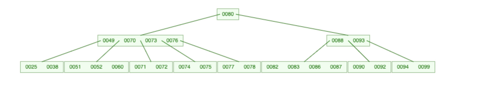
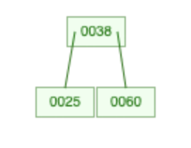
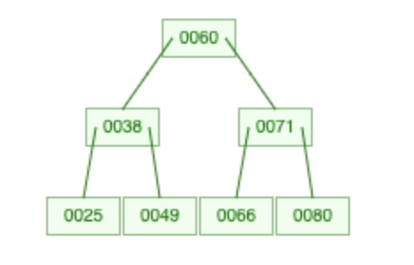
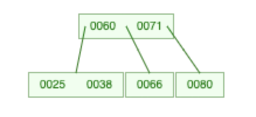
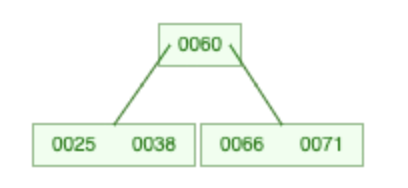
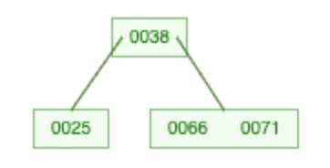

B 树是一种自平衡的树，又名 m 叉平衡多路查找树。<br>
它能够保持数据有序，能够让查找数据、顺序访问、插入数据及删除的动作，都在对数时间内完成。<br>
这种数据结构主要用于数据库和文件系统的实现。

在这里借助 USFCA 的 [B-Tree Visualization](https://www.cs.usfca.edu/~galles/visualization/BTree.html) 来生成 B 树的图，帮助我理解 B 树的抽象数据。(Appreciate that awesome website 👍🏻 )

一棵 5 阶 B 树长下面这个样子：



其中每个结点都包含一个关键字 (keywords) 数组和一个分支 (branches) 数组。<br>
随便取一个关键字，它左边的分支里的所有关键字都比它要小，而它右边的分支所有关键字都比它大，但又都比它的下一位关键字要小。<br>
也就是会满足这个条件：**`子树1` < `关键字1` < `子树2` < `关键字2` < `子树3` < ······**

一棵 m 阶 B 树有以下性质：
- B 树中所有结点的分支结点最大为 m，（除根结点外）最少有 ceil(m/2) 个分支，也就是最少会有 ceil(m/2) - 1 个关键字。<br>
  根结点最少有 2 个分支，也就是最少会有 1 个关键字。
- 如果一个结点有 n 个分支，那它一定有 n+1 个关键字。
- 叶子结点都在同一层。
- 对于任何一个结点，它的所有子树高度都相同。~反正看起来很顺眼就对了~

从查找效率考虑，一般要求 m ≥ 3。

---

讲完理论，整点实际的。看看用代码怎么实现上面的效果。

王道视频里整的是 5 叉树，我这里随随便便弄个 3 叉的就好了。

```c
#define M 3          // 定义B树的最大度数为3
#define MAX_HEIGHT 3 // 定义B树的最大高度为3
```

首先需要定义 B 树的结点结构：
```c
typedef struct BTreeNode
{
  int keywords[M];                   // 节点中存储的关键字数组
  struct BTreeNode *branches[M + 1]; // 分支指针数组
  int keywordLength, branchLength;   // 关键字个数和子结点个数
  bool isLeaf;                       // 是否为叶子结点
} BTreeNode, *BTree;
```

其中实际上存储的 keywords 长度不会超过 M-1，而 branches 长度不会超过 M。<br>
留多一位是因为在插入的时候会有出现先溢出后处理的情况，避免数组越界。<br>
因为 M = 3，所以除了根节点之外的结点最少有 2 个分支，最少会有 1 个关键字。

然后写初始化 B 树的方法：

```c
void InitBTree(BTree *t)
{
  *t = (BTree)malloc(sizeof(BTreeNode)); // 分配内存
  for (int i = 0; i < M; i++)            // 初始化子结点指针数组
  {
    (*t)->branches[i] = NULL;
  }
  (*t)->keywordLength = 0; // 初始化关键字个数为0
  (*t)->branchLength = 0;  // 初始化子结点个数为0
  (*t)->isLeaf = true;     // 初始化为叶子结点
}
```

好的，这样一棵 B 树就创建完成了：

```c
int main()
{
  BTree BT;
  InitBTree(&BT);
  return 0;
}
```

接下来需要向 B 树里面插入数据，因为 B 树的要求是要让它的高度最小，所以关键字和分支需要尽可能的满，越多越好。<br>
在叶子结点进行插入，从底向上逐渐建树。<br>
这句话啥意思呢？初始我们只有一个 B 树结点，当插入超过 M - 1 个关键字后，这个结点就会开始分裂成 3 部分。<br>
从这样：


变成这样：



中间的那个关键字会上升，插入至父结点中去，而左、右两边的关键字数组会作为上升的关键字的左、右分支。<br>
因为这里只是 3 叉树，左、右关键字数组分裂后长度只有 3 / 2 = 1，假如是 5 叉树，左、右关键字数组长度为 5 / 2 = 2。<br>
假如这次插入使得父节点也超过 M - 1 个关键字，那对父节点也进行相同的操作，直至传递到根节点为止。

那编写插入方法的思路就是这样的：
1. 尝试在结点中插入关键字，如果该结点不是叶子结点，则递归地向下查找应该插入到哪个子树中，然后重复执行 (1)。
2. 在叶子结点中插入关键字，如果导致结点关键字数组长度超过 M - 1，则执行 (3)。否则插入方法执行完毕。
3. 插入关键字后结点关键字数组长度超过 M - 1，将该结点的关键字一分为二。
    创建并初始化左子树和右子树，将前半部分放到左子树中，后半部分放到右子树中。
    将原结点的分支数组也一分为二，并将左子树的分支指针和右子树的分支指针分别指向这些分支。
4. 将原结点的第一个分支指针指向左子树，第二个分支指针指向右子树。

根据上述思路写出的代码：
```c
// 将关键字插入到结点中
int RawInsertKeyword(BTreeNode *node, int keyword)
{
  int left = 0, right = node->keywordLength - 1; // 二分查找插入位置
  while (left <= right)
  {
    int mid = (left + right) / 2;
    if (node->keywords[mid] == keyword) // 如果关键字已存在，则返回位置
      return mid;
    else if (node->keywords[mid] < keyword)
      left = mid + 1;
    else
      right = mid - 1;
  }
  for (int j = node->keywordLength; j > left; j--) // 将大于插入值的关键字右移
  {
    node->keywords[j] = node->keywords[j - 1];
  }
  node->keywords[left] = keyword; // 插入关键字
  node->keywordLength++;          // 关键字个数加1
  return left;                    // 返回插入位置
}

// 将一个B树结点分裂为两个
void SplitBTreeNode(BTreeNode *node)
{
  // 初始化左子树和右子树
  BTree LBT;
  BTree RBT;
  InitBTree(&LBT);
  InitBTree(&RBT);

  // 将原结点的关键字一分为二，前半部分放到左子树中，后半部分放到右子树中
  int mid = node->keywordLength / 2;
  int i = 0;
  for (; i < mid; i++)
  {
    RawInsertKeyword(LBT, node->keywords[i]);
  }
  for (i = mid + 1; i < node->keywordLength; i++)
  {
    RawInsertKeyword(RBT, node->keywords[i]);
  }
  node->keywords[0] = node->keywords[mid];
  node->keywordLength = 1;

  // 将原结点的分支数组也一分为二，并将左子树的分支指针和右子树的分支指针分别指向这些分支
  mid = node->branchLength / 2;
  int j = 0;
  for (; j < mid; j++)
  {
    LBT->branches[j] = node->branches[j];
    LBT->branchLength++;
    node->branches[j] = NULL;
  }
  for (; j < node->branchLength; j++)
  {
    RBT->branches[j - mid] = node->branches[j];
    RBT->branchLength++;
    node->branches[j] = NULL;
  }

  // 如果原结点有分支，则左子树和右子树也都是非叶子结点
  if (node->branchLength > 0)
  {
    LBT->isLeaf = false;
    RBT->isLeaf = false;
  }

  // 将原结点的第一个分支指针指向左子树，第二个分支指针指向右子树
  node->branches[0] = LBT;
  node->branches[1] = RBT;
  node->branchLength = 2;

  // 如果原结点是叶子结点，则分裂后左子树和右子树也都是叶子结点
  if (node->isLeaf)
    node->isLeaf = false;
}

// 向B树中插入一个关键字
void InsertKeyword(BTree *bt, int keyword)
{
  BTreeNode *p = *bt;
  if (p->isLeaf) // 如果当前结点是叶子结点，则直接将关键字插入到该结点中
  {
    RawInsertKeyword(p, keyword);
    if (p->keywordLength > M - 1) // 如果该结点的关键字个数超过了M-1，则需要进行分裂
    {
      SplitBTreeNode(p);
    }
  }
  else // 如果当前结点不是叶子结点，则需要递归地向下查找应该插入到哪个子树中
  {
    int i;
    for (i = 0; i < p->keywordLength; i++) // 找到第一个大于待插入关键字的关键字位置
    {
      if (keyword < p->keywords[i])
        break;
    }
    BTreeNode *b = p->branches[i]; // 跳到对应的子树
    InsertKeyword(&b, keyword);    // 递归插入关键字

    // 如果子结点分裂后，导致当前结点的某个子结点关键字个数为1且子结点有两个子树指针，则需要将此子结点合并到其他子结点中
    if (b->keywordLength == 1 && b->branchLength == 2)
    {
      int insertIndex = RawInsertKeyword(p, b->keywords[0]);  // 将子结点中的关键字插入到当前结点中
      for (int j = p->branchLength; j > insertIndex + 1; j--) // 将子树指针也插入到当前结点中
      {
        p->branches[j] = p->branches[j - 1];
      }
      p->branchLength++;
      p->branches[insertIndex] = b->branches[0];
      p->branches[insertIndex + 1] = b->branches[1];
      free(b);                      // 释放原来的子结点内存
      if (p->keywordLength > M - 1) // 如果当前结点的关键字个数超过了M-1，则需要进行分裂
      {
        SplitBTreeNode(p);
      }
    }
  }
}
```

这样 B 树的关键字插入操作就完成了。来打印试试，先写个打印方法：

```c
// 打印一个B树结点
void PrintBTreeNode(BTreeNode node)
{
  printf("[");
  for (int i = 0; i < node.keywordLength; i++)
  {
    printf("%d", node.keywords[i]);
    if (i < node.keywordLength - 1)
      printf(",");
  }
  printf("]");

  // 如果当前结点不是叶子结点，则需要递归打印它的所有子结点
  if (!node.isLeaf)
  {
    printf("(");
    for (int i = 0; i <= node.keywordLength; i++)
    {
      PrintBTreeNode(*(node.branches[i]));
      if (i < node.keywordLength)
        printf(",");
    }
    printf(")");
  }
}

// 打印整个B树
void PrintBTree(BTree bt)
{
  PrintBTreeNode(*bt);
  printf("\n");
}
```

然后往B树中插入一些关键字：

```c
// 往B树中插入一些关键字
int insertKeywords[] = {60, 25, 38, 49, 80, 66, 71};
int insertLength = sizeof(insertKeywords) / sizeof(int);
for (int i = 0; i < insertLength; i++)
{
  InsertKeyword(&BT, insertKeywords[i]);
}

// 打印插入完关键字后的B树
PrintBTree(BT);
```

打印结果为：
```shell
[60]([38]([25],[49]),[71]([66],[80]))
```

和这个生成图的结果是一致的：



然后来写删除关键字的方法。<br>
首先是对叶子结点的关键字删除，直接删除即可。如果删除后叶子结点的关键字数组长度小于 M / 2，就要**偷兄弟结点的关键字**。<br>
然后是对非叶子结点的关键字删除，在删除该关键字之后，把这个关键字的直接前驱或者直接后继置于这个关键字的位置。<br>
这实际上不算删除，而是一种替换。当置换上来后导致它的直接前驱或者直接后继的原结点的关键字数组长度小于 M / 2，也要**偷兄弟结点的关键字**。

那么这样看来，对任何结点的删除关键字操作都能转换成对叶子结点的删除关键字操作。<br>
关键在于这个**偷兄弟节点的关键字**的操作，具体是这样的：

1. 首先判断要偷左兄弟还是右兄弟，一般是偷右兄弟。~~好欺负？~~<br>当前结点为最后一个分支节点的话，就偷左兄弟。（确定好后下称兄弟结点）
2. 如果兄弟结点的关键字数组长度足够偷一个<br>（即 兄弟结点的关键字数组长度 - 1 >= M / 2），就直接偷。<br>
    将父结点对应位置的关键字下移插入至当前结点，然后把兄弟结点的第一个结点（如果是右兄弟的话就是最后一个结点）上移到父结点的对应位置。
3. 如果兄弟结点的关键字数组长度不够偷一个，那么就要进行合并操作。<br>
    将父结点对应位置的关键字下移到兄弟结点中，并将当前结点和兄弟结点合并为一个结点。对应位置的子树指针也要往前移一位。
4. 上述下移父结点关键字的操作导致父结点的关键字长度不满足条件的话，则对父结点也进行同样的偷兄弟结点关键字的操作。（这里当然是偷父结点的兄弟）<br>
   然后一直传递到根结点。
5. 如果最后导致根结点关键字数组长度为0，它就只会有唯一的分支结点，将这个分支结点作为新的根节点。

因此根据上述思路写出来的代码是这样的：

```c
// 从兄弟结点中偷一个关键字到当前结点中
void StealingKeyword(BTreeNode *bt, BTreeNode *parentNode, int index)
{
  if (parentNode) // 如果有父结点，则进行关键字的“偷取”
  {
    bool way = index == parentNode->branchLength - 1;                       // 确定被“偷取”的分支是在父结点的左边还是右边
    BTreeNode *sibling = parentNode->branches[way ? index - 1 : index + 1]; // 找到被“偷取”的兄弟分支
    if (sibling->keywordLength - 1 >= M / 2)                                // 如果兄弟分支的关键字数量仍然足够，则进行关键字的“偷取”
    {
      bt->keywords[1] = parentNode->keywords[index];      // 将父结点的关键字插入到当前分支中
      parentNode->keywords[index] = sibling->keywords[0]; // 将兄弟分支的最小关键字插入到父结点中
      bt->keywordLength++;                                // 当前分支的关键字数量加1
      sibling->keywordLength--;                           // 兄弟分支的关键字数量减1
      for (int i = 0; i < sibling->keywordLength; i++)    // 将兄弟分支中的剩余关键字往前移动一位
      {
        sibling->keywords[i] = sibling->keywords[i + 1];
      }
    }
    else // 如果兄弟分支的关键字数量不足，则进行合并
    {
      if (index == 0)
        sibling = parentNode->branches[index + 1];
      else if (!way)
        sibling = parentNode->branches[index - 1];

      if (index == 0) // 如果当前分支在父结点的最左边，则将当前分支合并到右侧的兄弟分支中
      {
        bt->keywords[bt->keywordLength] = parentNode->keywords[index]; // 将父结点中的关键字插入到当前分支的最后
        bt->keywordLength++;                                           // 当前分支的关键字数量加1
        int i = 0;
        for (; i < sibling->keywordLength; i++) // 将兄弟分支中的关键字插入到当前分支中
        {
          bt->keywords[bt->keywordLength] = sibling->keywords[i];
          bt->keywordLength++;
        }
        for (i = 0; i < sibling->branchLength; i++) // 将兄弟分支中的子结点插入到当前分支中
        {
          bt->branches[bt->branchLength] = sibling->branches[i];
          bt->branchLength++;
        }
        parentNode->keywordLength--;                    // 父结点的关键字数量减1
        parentNode->branchLength--;                     // 父结点的分支数量减1
        free(sibling);                                  // 释放兄弟分支占用的内存
        for (i = 0; i < parentNode->keywordLength; i++) // 将父结点中的关键字和分支向前移动一位
        {
          parentNode->keywords[i] = parentNode->keywords[i + 1];
          parentNode->branches[i + 1] = parentNode->branches[i + 2];
        }
      }
      else // 如果当前分支不在父结点的最左边，则将当前分支合并到左侧的兄弟分支中
      {
        sibling->keywords[sibling->keywordLength] = parentNode->keywords[index - 1]; // 将父结点中的关键字插入到兄弟分支的最后
        sibling->keywordLength++;                                                    // 兄弟分支的关键字数量加1
        int i;
        for (i = 0; i < bt->keywordLength; i++) // 将当前分支中的关键字插入到兄弟分支中
        {
          sibling->keywords[sibling->keywordLength] = bt->keywords[i];
          sibling->keywordLength++;
        }
        for (i = 0; i < bt->branchLength; i++) // 将当前分支中的子结点插入到兄弟分支中
        {
          sibling->branches[sibling->branchLength] = bt->branches[i];
          sibling->branchLength++;
        }
        parentNode->keywordLength--;                            // 父结点的关键字数量减1
        parentNode->branchLength--;                             // 父结点的分支数量减1
        free(parentNode->branches[index]);                      // 释放当前分支占用的内存
        for (i = index - 1; i < parentNode->keywordLength; i++) // 将父结点中的关键字和分支向前移动一位
        {
          parentNode->keywords[i] = parentNode->keywords[i + 1];
          parentNode->branches[i + 1] = parentNode->branches[i + 2];
        }
      }
    }
  }
  else if (bt->keywordLength == 0 && bt->branchLength == 1) // 如果下移的父结点是根结点，且导致根结点关键字长度为0，则将唯一的分支结点作为新的根节点
  {
    int i = 0;
    BTreeNode *b = bt->branches[0];
    for (; i < b->keywordLength; i++) // 将子结点中的关键字插入到当前结点中
    {
      bt->keywords[i] = b->keywords[i];
      bt->keywordLength++;
    }
    bt->branchLength--;                   // 当前结点的子结点数量减1
    for (i = 0; i < b->branchLength; i++) // 将子结点中的子结点插入到当前结点中
    {
      bt->branches[i] = b->branches[i];
      bt->branchLength++;
    }
    free(b); // 释放子结点占用的内存
  }
}

// 从B树中删除一个关键字
void DeleteKeyword(BTree *bt, int keyword)
{
  BTreeNode *p = *bt;
  BTreeNode *routes[MAX_HEIGHT + 1]; // 用于记录走过的结点路径，方便结点找到它的父结点
  routes[0] = NULL;                  // 第一位设为空，因为根结点没有父结点
  int i, j = 1, index;

  // 在B树中查找要删除的关键字，并记录查找路径
  for (i = 0; i < p->keywordLength; i++)
  {
    if (p->keywords[i] == keyword) // 如果找到了要删除的关键字，则直接跳出循环
      break;
    else if (p->branchLength > 0) // 如果当前结点不是叶子结点，则需要向下递归查找
    {
      if (p->keywords[i] > keyword) // 如果当前关键字大于要删除的关键字，则需要向左子树继续查找
      {
        routes[j++] = p;
        index = i;
        p = p->branches[index];
        i = -1; // 因为后面还要执行i++，所以这里先将i设为-1，以便下一轮循环开始时i正确地变为0
      }
      else if (i + 1 == p->keywordLength) // 如果当前关键字是该结点中最后一个关键字，则需要向右子树继续查找
      {
        routes[j++] = p;
        index = i + 1;
        p = p->branches[index];
        i = -1; // 同上
      }
    }
  }
  routes[j] = p;

  // 如果没有找到要删除的关键字，则直接返回
  if (i == p->keywordLength)
    return;

  if (p->isLeaf) // 如果要删除的关键字在叶子结点中，则直接删除即可
  {
    p->keywordLength--;
    for (int j = i; j < p->keywordLength; j++)
    {
      p->keywords[j] = p->keywords[j + 1];
    }

    // 现在需要检查是否需要进行合并或借用操作，以保证B树的平衡性
    while (j > 0 && p->keywordLength < M / 2)
    {
      StealingKeyword(p, routes[j - 1], index); // 首先尝试从兄弟结点中偷取一个关键字
      p = routes[--j];
      int k = 0;
      if (j > 1)
      {
        for (; k < routes[j - 1]->branchLength; k++)
        {
          if (p == routes[j - 1]->branches[k])
            break;
        }
        if (k == routes[j - 1]->branchLength)
          break;
      }
      index = k;
    }
  }
  else // 如果要删除的关键字在非叶子结点中，则需要找到它的后继关键字来替换它
  {
    index = i;
    routes[++j] = p->branches[index];
    BTreeNode *b = routes[j];

    // 找到后继关键字所在的叶子结点，并记录查找路径
    while (!b->isLeaf)
    {
      index = b->branchLength - 1;
      b = routes[++j] = b->branches[index];
    }

    // 将后继关键字替换为要删除的关键字
    int substitution = b->keywords[b->keywordLength - 1];
    p->keywords[i] = substitution;
    b->keywordLength--;

    // 现在需要检查是否需要进行合并或借用操作，以保证B树的平衡性
    if (b->keywordLength < M / 2)
    {
      StealingKeyword(b, routes[j - 1], index);
    }
  }
}
```

对所有可能出现的情况都试验一下，从B树中删除一些关键字，并打印每次删除后的B树：

```c
int deleteKeywords[] = {49, 60, 80};
int deleteLength = sizeof(deleteKeywords) / sizeof(int);
for (int j = 0; j < deleteLength; j++)
{
  DeleteKeyword(&BT, deleteKeywords[j]);
  PrintBTree(BT);
}
```

在删除叶子结点的关键字 49 后，打印结果为：`[60,71]([25,38],[66],[80])`<br>
生成图为：



在删除叶子结点的关键字 80 后，打印结果为：`[60]([25,38],[66,71])`<br>
生成图为：



在删除非叶子结点的关键字 60 后，打印结果为：`[38]([25],[66,71])`<br>
生成图为：



试验应该是成功的，那么 B 树的删除方法就这样算完成了。<br>
完整的实现代码请点[这里](https://github.com/glitchboyl/CS/blob/main/DataStructure/B-Tree.c)查看。

---

最后来总结一下吧。

我在看视频学习 B 树的时候，发现他们都只讲逻辑理论，而不会讲具体的代码实现。<br>
于是我动手实现了一遍，发现思路虽然很清晰，但是用代码真的很难表达出来，卡了我两三天才写出来。<br>
然后我明白了，要是考试的时候要你手写 B 树的代码，那不得拿命写？<br>
所以只要掌握一个逻辑理论的概念就好了。~~心里要有 B 树~~

其实代码还有很多可以优化的空间，比如插入关键字时可以用二分查找来查找插入位置，etc...<br>
但我应该懒得优化了... 因为对于现在的我太烧脑了。
