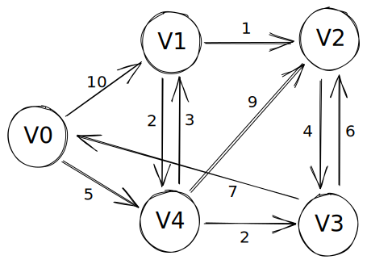

狄克斯特拉算法 (Dijkstra) 是一种解决有权图中最短路径问题的算法。<br>
它主要采用的是贪心算法的策略，每次遍历到始点距离最近且未访问过的顶点的邻接顶点，直到扩展到终点为止。<br>
与 **广度优先遍历算法 (BFS)** 相比，BFS 算法只能适用于无权图或边的权值都相同的图，而 Dijkstra 算法基本适用于除了负权图之外的任何图。

---

假如现在有一个这样的图：



那么用邻接矩阵的方式是这样定义：
```c
int graph[5][5] = {
  {0, 10, 0, 0, 5},
  {0, 0, 1, 0, 2},
  {0, 0, 0, 4, 0},
  {7, 0, 6, 0, 0},
  {0, 3, 9, 2, 0}
};
```

现在，假如我想求解从顶点 V0 到顶点 V2 的最短路径，通过例图可以很直观的看到顶点 V0 到顶点 V2 之间有不止一条路径。<br>
但最短的是哪一条需要通过计算才能得出，这时候就可以使用 Dijkstra 算法来解决这个问题。

Dijkstra 算法需要借助一些辅助数组用于储存信息：
```c
bool final[V]; // 记录每个顶点是否已经确定最短路径
int dist[V],   // 记录源顶点与每个顶点的最短路径长度
    path[V];   // 记录每个顶点的最短路径的前驱顶点下标
```

首先需要初始化这些数组：
```c
// 初始化
for (int i = 0; i < V; i++)
{
  final[i] = false; // 初始时所有顶点都未确定最短路径
  dist[i] = graph[start][i] ? graph[start][i]
                            : INT_MAX; // 源顶点到自己的距离为0，到其他顶点的距离初始值为该边权值（如果有），否则为无穷大
  path[i] = graph[start][i] ? start
                            : -1; // 记录每个顶点在最短路径上的前一个顶点，如果直接到达，则记录为 start；否则标记为 -1。
}
final[start] = true; // 将源顶点加入已确定最短路径集合中
dist[start] = 0;     // 源顶点到自己的距离为0
```

以顶点 V0 为弧尾，它的有向边只能连到顶点 V1 和 V4，权值分别为 10 与 5，这是**当前**能找到的最短路径。<br>
那么，初始化后这些数组的呈现出来的直观数据表格是这样的：

| &nbsp; | final | dist | path |
| ------ | ----- | ---- | ---- |
| V0     | true  | 0    | -1   |
| V1     | false | 10   | 0    |
| V2     | false | ∞    | -1   |
| V3     | false | ∞    | -1   |
| V4     | false | 5    | 0    |

接下来需要查找未确定最短路径的距离最小的顶点，那先来写个查找的辅助方法：
```c
// 找到 dist[] 中未确定最短路径的最小值并返回其下标
int minDistance(int dist[], bool final[])
{
  int min = INT_MAX, minIndex;
  for (int i = 0; i < 5; i++)
  {
    // 如果 i 未确定最短路径，且 i 的距离值比当前最小值还小
    if (!final[i] && dist[i] < min) 
    {
      min = dist[i];
      minIndex = i;
    }
  }
  return minIndex;
}
```

目前还未确定最短路径的顶点有：V1, V2, V3, V4。而在它们之中距离最小的为 5，也就是顶点 V4，标记该顶点已经确定最短路径。<br>
在此基础上计算该顶点能连到的未确定最短路径的顶点的距离，如果 **源顶点到该顶点的距离** 加上 **这段距离** 比数组中记录的 **源顶点到未确定的顶点目前的最短距离** 还要短的话，就在数组替换掉。

```c
int u = minDistance(dist, final); // 找到未确定最短路径的距离最小的顶点
final[u] = true;                  // 标记该顶点已经确定最短路径
for (int k = 0; k < 5; k++)
{
  if (final[k]) // 如果顶点 k 已经确定最短路径，则跳过
    continue;
  if (graph[u][k]) // 如果 u 到 k 存在边
  {
    int d = dist[u] + graph[u][k]; // 计算从源顶点到 k 的距离
    if (d < dist[k])               // 如果从 u 经过 k 到达的距离比当前记录的距离还要小
    {
      dist[k] = d; // 更新 k 的距离值
      path[k] = u; // 修改 k 在最短路径上的前一个顶点
    }
  }
}
```
例如，在上述代码中，当 k = 1 即遍历到顶点 V1，它并未确定最短路径。<br>
而因为顶点 V4 与顶点 V1 之间存在一条以 V4 为弧头连到 V1 的边，其权值为 3。那么也就是说从 V0 --> V4 --> V1 是连通的。<br>
通过计算可以得知，这条路径的长度为：5 + 3 = 8，它小于顶点 V1 在数组中存储的最短路径 10。<br>
然后把这个数据从数组中替换掉，并把顶点 V1 的前驱顶点改为 V4。

上述步骤后，数组的呈现出来的直观数据表格是这样的：

| &nbsp; | final | dist | path |
| ------ | ----- | ---- | ---- |
| V0     | true  | 0    | -1   |
| V1     | false | 8    | 4    |
| V2     | false | 9    | 4    |
| V3     | false | 2    | 4    |
| V4     | true  | 5    | 0    |

---

OK，那么就是重复上述工作，直到所有顶点都确定最短路径即可。<br>
完整的实现代码请点[这里](https://github.com/glitchboyl/CS/blob/main/DataStructure/Algorithm/Dijkstra.c)查看。

它的输出结果为：
```shell
path is: 2 <-- 1 <-- 4 <-- 0 
its distance is 9
```

至于为什么是这样的输出，因为你只能从目标顶点出发寻找它的最短路径的前驱顶点。

或者可以使用栈的方式来输出。（但这又需要多一轮循环）

---

那么 Dijkstra 算法就完成了，它的时间复杂度应为 O(V²)。<br>
我感觉它其实和 [Prim 算法](https://github.com/glitchboyl/CS/blob/main/DataStructure/Algorithm/Prim.c)有些相似的地方，都是需要用到辅助数组来存储访问信息和最小代价。

除了这个算法，Dijkstra 这名伟大的计算机科学家还提出了一些别的理论知识。<br>
例如 PV原语、银行家算法、哲学家进餐问题等。

他一个人就在 408 中占据了大概 40 分左右，可见他的 new bee。

本文到这里就结束了，希望以上内容能对你有所帮助。
