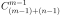

近些日子一直在刷 [leetcode](https://leetcode.com/glitchboyl/)，除了学习一些数据结构和算法思维，也算是为找工作做准备。

刷题刷多了就会发现，算法技巧就那几个套路，把各种解题框架套进去基本都能解，but

在这里面有类题目最令我头疼的，也是面试常考的算法类型：**动态规划（Dynamic Programming）**，简称 DP。

~~当然其实所有算法题都令我头疼，算法苦手 :cry:~~

---

引用 [wikipedia](https://en.wikipedia.org/wiki/Dynamic_programming) 对动态规划的描述：

> ...it refers to simplifying a complicated problem by breaking it down into simpler sub-problems in a [recursive](https://en.wikipedia.org/wiki/Recursion) manner. 

讲人话就是：

> 动态规划是以递归的方式去将复杂的问题分解为更简单的子问题来简化问题。

动态规划解决问题的关键特征和步骤包括：

- 最优子结构：将问题分解成子问题之后求出的子问题的最优解。
- 状态转移：利用最优子结构，定义问题状态之间的关系，构造问题的最优解。
- 存储中间结果：避免重复计算，提高效率。

如果问题具备以上三点，那么它就是一个典型的动态规划问题。

~~但就难在我察觉不到它具备。~~

动态规划问题一般都是求最值，例如 [62. Unique Paths](https://leetcode.com/problems/unique-paths/) 求到达右下角（最多）有几种路径，

或是 [72. Edit Distance](https://leetcode.com/problems/edit-distance/) 求从 word1 变成 word2 最少编辑次数，etc...

一般遇到这类问题，除了穷举出所有答案选择最值，压根想不到什么解决方法。接下来我就试着举几个例子来讲讲我如何理解动态规划。

---

### [509. Fibonacci Number](https://leetcode.com/problems/fibonacci-number/)

斐波那契数列是一个很典型的递归问题，解法非常简单：

```rust
fn fib(n) -> i32 {
  if n <= 1 {
    return n;
  }
  fib(n - 1) + fib(n - 2)
}
```

但这样解有个问题，在算 `fib(n - 1)` 时，实际上也计算了 `fib(n - 2)`，这样就导致了重复计算。

可以通过建立一个 map 来储存已经计算过的值来优化：

```rust
fn fib(n) -> i32 {
  let mut map = vec![0, 1];
  for i in 2..=n {
    map[i] = map[i - 1] + map[i - 2];
  }
  map[n]
}
```

上面这种方式其实就是用[动态规划](https://en.wikipedia.org/wiki/Dynamic_programming#Fibonacci_sequence)来解决，要计算原问题 `fib(n)`，需要先计算它的子问题 `fib(n - 1)` 和 `fib(n - 2)`，而计算 `fib(n - 1)` 又要计算它的子问题 `fib(n - 2)` 和 `fib(n - 3)`... 以此类推，直到它的 base case `fib(0) = 0` 和 `fib(1) = 1`。

然后再从 base case 自底向上推出所有子问题的答案，最终得到问题的答案。这个自底向上的过程就是**状态转移**，在循环内，`i` 的值会不断变化，如果把 `i` 当做一个状态，这个状态就是由状态 `i - 1` 和状态 `i - 2` 转移（相加）而来。

动态规划的难点，就是写出状态转移方程。接着看。

---

### [62. Unique Paths](https://leetcode.com/problems/unique-paths/)

给一个 m × n 的网格，只能向右或者向下移动，求出从最左上角到最右下角有几种路径。


首先是穷举的写法：

```rust
fn unique_paths(m: i32, n: i32) -> i32 {
  fn move_to(i: i32, j: i32, m: i32, n: i32) -> i32 {
    // reach the goal
    if i == m - 1 && j == n - 1 {
      return 1;
    }
    // boundary handle
    if i == m || j == n { 
      return 0;
    }
    // only move to right or down
    move_to(i, j + 1, m, n) + move_to(i + 1, j, m, n)
  }
  move_to(0, 1, m, n) + move_to(1, 0, m, n)
}
```

只能向右或者向下移动，通过递归调用考虑这两种移动的情况：

- 当 `i == m - 1 && j == n - 1` 时说明已经到达目的地，那么这就是一条有效路径，返回 1。
- 当 `i == m || j == n` 时说明超出了边界，那么这是一条无效路径，返回 0。

这种递归实现会涉及大量的重复计算，因为在计算一个路径的可能性时多次计算了相同位置的子问题。

用动态规划来解决问题，base case 为 `m = 1 || n = 1` 时，那么它只有 1 条路径数。

将问题分解为求从最左上角到某个格的路径数，因为只能向右或者向下移动，那么其实状态转移方程为：

> 移动到某一格的路径数 = 移动到该格左边格子的路径数 + 移动到该格上边格子的路径数

创建一个 m × n 的二维数组 `dp`，`dp[i][j]` 所表示的是从 `(0, 0)` 到 `(i, j)` 的路径数。

```rust
fn unique_paths(m: i32, n: i32) -> i32 {
  // initialize dp
  let mut dp = vec![vec![1; n]; m];
  for i in 1..m {
    for j in 1..n {
      dp[i][j] = dp[i - 1][j] + dp[i][j - 1];
    }
  }
  dp[m - 1][n - 1]
}
```

这样动态规划解法就完成了。其实这题还可以利用数学中的组合来解：

因为移动限制，所以每一条路径经过的格子数都是一样的，都需要走 `(m - 1) + (n - 1)` 步。即每条路径，都需要向下移动 `(m - 1)` 次，向右移动 `(n - 1)` 次，移动的组合即为路径数，因此可以得到公式： 

```rust
fn unique_paths(m: i32, n: i32) -> i32 {
  // use shadowing: m -> (m - 1), n -> (n - 1)
  let m = m as u64 - 1;
  let n = n as u64 - 1;
  (1..=n).fold(1u64, |acc, x| acc * (m + x) / x) as _
}
```

~~但像我这种 🥬:dog: 哪里想得到~~

